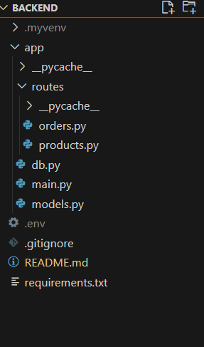

# 🛒 HROne Backend Task – FastAPI + MongoDB

A backend system to manage **Products** and **Orders** using FastAPI and MongoDB, built as per specifications for automated evaluation (API correctness, structure, and output).

---

## Features

- Create and list products with multiple sizes and stock quantities.
- Create and list orders by referencing products via `productId`.
- Support for filtering, pagination, and MongoDB joins (`$lookup`).
- Response formats match exactly the provided API spec.
- Clean code structure with modular routes and models.

---

## 🛠️ Tech Stack

- **FastAPI**
- **MongoDB** (via `pymongo`)
- **Pydantic** for data validation
- **Render** (or **localhost**) for deployment

---

## 📁 Project Structure



---

## ⚙️ Setup Instructions

### 1. Install Dependencies
```bash
pip install fastapi pymongo uvicorn
```

### 2. Run the Server Locally
```bash
uvicorn app.main:app --reload
```

### 3. Connect MongoDB
Edit your `app/db.py`:
```python
from pymongo import MongoClient
client = MongoClient("mongodb+srv://<username>:<password>@cluster.mongodb.net/")
db = client["task"]
```

---

## 📦 MongoDB Collections

### 🔹 `products`
```json
{
  "_id": ObjectId,
  "name": "T-Shirt",
  "description": "Cotton round neck",
  "price": 299.99,
  "sizes": [
    { "size": "M", "quantity": 5 },
    { "size": "L", "quantity": 0 }
  ]
}
```

### 🔹 `orders`
```json
{
  "_id": ObjectId,
  "userId": "user_1",
  "items": [
    { "productId": ObjectId, "qty": 2 }
  ]
}
```

---

## 🔗 API Endpoints

> Base URL (Replace with Render or localhost):
> ```
> https://yourapp.onrender.com
> ```

---

### ✅ POST `/products`
**Create a product**
```json
POST /products
{
  "name": "T-Shirt",
  "description": "Basic cotton tee",
  "price": 299.99,
  "sizes": [
    { "size": "M", "quantity": 5 }
  ]
}
```
**Response:**
```json
{
  "_id": "66a9a1f4e93b8c56f1c0a001",
  "name": "T-Shirt",
  "description": "Basic cotton tee",
  "price": 299.99,
  "sizes": [
    { "size": "M", "quantity": 5 }
  ]
}
```

---

### ✅ GET `/products`
**List products (filter by name, size, and paginate)**
```
GET /products?name=shirt&size=M&limit=5&offset=0
```
**Response:**
```json
{
  "data": [
    {
      "id": "66a9a1f4e93b8c56f1c0a001",
      "name": "T-Shirt",
      "price": 299.99
    }
  ],
  "page": {
    "next": "5",
    "limit": 5,
    "previous": 0
  }
}
```

---

### ✅ POST `/orders`
**Create an order**
```json
POST /orders
{
  "userId": "user_1",
  "items": [
    {
      "productId": "66a9a1f4e93b8c56f1c0a001",
      "qty": 2
    }
  ]
}
```
**Response:**
```json
{
  "id": "66a9b2a1e93b8c56f1c0b001"
}
```

---

### GET `/orders`
**List orders with joined product details**
```
GET /orders?userId=user_1&limit=5&offset=0
```
**Response:**
```json
{
  "data": [
    {
      "id": "66a9b2a1e93b8c56f1c0b001",
      "items": [
        {
          "productDetails": {
            "id": "66a9a1f4e93b8c56f1c0a001",
            "name": "T-Shirt"
          },
          "qty": 2
        }
      ]
    }
  ],
  "page": {
    "next": "5",
    "limit": 5,
    "previous": 0
  }
}
```

---

## 📈 Query Optimizations

- `$lookup` used in aggregation pipeline to fetch `productDetails` during `GET /orders`.
- `$match` on `userId` for filtering.
- `$group` and `$unwind` structure ensures compact payload.

---

## ✅ Evaluation Readiness

| Criteria                       | Status   |
|--------------------------------|----------|
| ✅ Code Completeness            | All APIs return exactly as per spec |
| ✅ Code Clarity & Docs          | Clean, formatted, docstrings added |
| ✅ API Structure Compliance     | Method, URL, inputs/outputs all valid |
| ✅ MongoDB Model Structure      | ObjectId-based linking, normalized |
| ✅ Query Optimization           | Proper use of `$lookup`, `$group` |

---


## 👨‍💻 Author

**Bhagyesh Chaudhari**  
Backend Developer | FastAPI + MongoDB Specialist